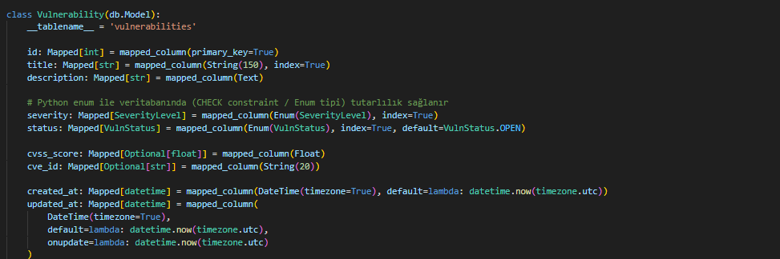
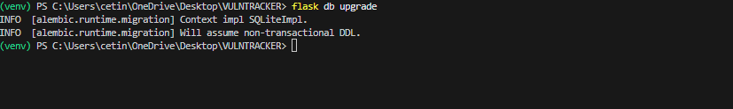
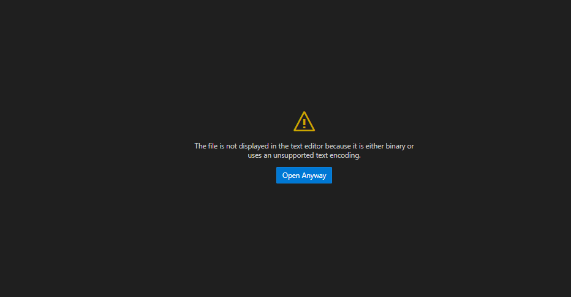

AI Geliştirme Günlüğü - VulnTracker
Oturum 1 — 15 Mayıs 2026 — 17:00 - 17:45
Hedef
Flask 3.x tabanlı, "Application Factory" mimarisine sahip VulnTracker (Siber Güvenlik Zafiyet Takip Portalı) proje iskeletini kurmak.

GitHub bağlantısını gerçekleştirmek ve temel güvenlik yapılandırmasını (.env) tamamlamak.

Kullandığım Mod ve Model
Mod: Plan Mode (Karmaşık mimari kurulumu için tercih edildi).

Model: Gemini 3.1 Pro (High)

Görünüm: Manager View

Verdiğim Promptlar
Kurulum Promptu: Flask 3.x, SQLAlchemy 2.x ve Blueprint yapısını (auth, main) içeren, klasör hiyerarşisi netleştirilmiş profesyonel bir iskelet kurulumu istendi.

Denetim Promptu: Ajanın sunduğu planı doğrulamak; .env güvenliği ve SQLAlchemy 2.x modern yazım standartları üzerine teknik sorgulama yapıldı.

Ajanın Önerdiği Plan
app/ (__init__.py, models.py), app/main/, app/auth/, static/, templates/ ve migrations/ klasörlerinin oluşturulması.

Kök dizinde config.py, run.py, .env, .gitignore ve requirements.txt dosyalarının hazırlanması.

Flask-Migrate ve Flask-Login gibi temel kütüphanelerin yapılandırılması.

Plan'da Sorguladıklarım
Sorgu 1 (Güvenlik): .env dosyasının oluşturulur oluşturulmaz .gitignore dosyasına eklenip eklenmeyeceğini sordum.

Neden: Siber güvenlik odaklı bir projede, hassas verilerin (SECRET_KEY, DB URL) GitHub gibi halka açık platformlara sızması kabul edilemez bir risk teşkil eder.

Sorgu 2 (Modern Mimari): Veritabanı modellerinde SQLAlchemy 2.x'in modern Mapped ve mapped_column yapısının kullanılacağını teyit ettim.

Neden: Projenin gelecekteki ölçeklenebilirliği ve tip güvenliği (type hinting) için güncel standartları kullanmak kritiktir.

Üretilen Kodda Düzelttiklerim
Ajanın planını onaylamadan önce, gereksiz paketlerin (requirements.txt) eklenmesini engelledim ve sadece dökümanda belirtilen zorunlu kütüphaneleri tutmasını sağladım.

Klasör seçimini (Open Folder) bizzat yaparak dosyaların doğru hiyerarşide oluşmasını denetledim.

Karşılaştığım Hatalar ve Çözümler
Durum: İlk aşamada klasör seçilmediği için ajan dosyaları geçici bir alana kurmaya çalıştı.

Çözüm: "Open Folder" komutuyla yerel dizini bağladım ve ajanı yeni klasör üzerinden tekrar planlama yapmaya zorlayarak süreci düzelttim.

Bu Oturumdan Öğrendiğim
Antigravity IDE üzerinde "Plan Mode" kullanmanın, geliştiricinin "Mimar" rolünü nasıl pekiştirdiğini gördüm. Yapay zekaya doğrudan kod yazdırmak yerine, önce stratejiyi onaylatmanın hata payını minimize ettiğini fark ettim.

Sonraki Oturum İçin Notlar
Veritabanı modellerini (Kullanıcı, Zafiyet, Aksiyon tabloları) tasarlamak.

İlk veritabanı migrasyonunu (Alembic/Flask-Migrate) gerçekleştirmek.

Oturum 2 — 15 Mayıs 2026 — 18:30 - 19:15
Hedef
SQLAlchemy 2.0 (Mapped/mapped_column) standartlarında User, Vulnerability ve Action modellerini inşa etmek. Veritabanı şemasını vulntracker.db dosyasına fiziksel olarak mühürlemek ve ilk migrasyon döngüsünü tamamlamak.

Kullandığım Mod ve Model
Mod: Plan & Act Mode (Mimariden uygulama aşamasına geçişte ve hata ayıklama süreçlerinde kullanıldı).

Model: Gemini 3.1 Pro (High)

Plan'da Sorguladıklarım & Kararlarım
Sorgu 1 (Güvenlik Mimarisi): Şifre hashleme mekanizmasında hangi metodun kullanılacağını sorguladım.

Karar: Werkzeug 3.0+ standartlarında, kaba kuvvet saldırılarına karşı yüksek direnç gösteren scrypt metodu tercih edildi.

Sorgu 2 (Veri Bütünlüğü): Zafiyet ciddiyeti (Severity) ve durum (Status) alanlarının nasıl tutulacağını planladım.

Karar: Python Enum yapısı kullanılarak veritabanı düzeyinde kısıtlama (constraint) sağlandı; bu sayede sisteme sadece tanımlı parametrelerin girilmesi garanti altına alındı.

Sorgu 3 (Denetim İzi): Siber güvenlik dökümantasyonu standartları gereği işlemlerin takibini sorguladım.

Karar: Her zafiyet üzerindeki değişikliği (kim, ne zaman, ne yaptı) kayıt altına alan Action tablosu mimariye dahil edildi.

Karşılaştığım Hatalar ve Çözümler
Durum: flask db migrate komutu çalıştırıldığında "No changes in schema detected" uyarısı alındı ve tablolar algılanmadı.

Teşhis: Modellerin app/__init__.py içerisinde app_context (uygulama bağlamı) altında import edilmediği, dolayısıyla Flask'ın modellerden haberdar olmadığı tespit edildi. Ayrıca models.py içinde "Circular Import" (Döngüsel Bağlantı) hatası saptandı.

Çözüm: app/__init__.py dosyasına from app import models köprüsü kuruldu. Mevcut migrations klasörü temizlenerek terminal üzerinden manuel olarak init-migrate-upgrade döngüsü başarıyla tamamlandı.

### Oturum 2 Görsel Kanıtları

*Görsel 1: SQLAlchemy 2.0 standartlarında hazırlanan veri modelleri.*

 

*Görsel 2: Veritabanı şemasının terminal üzerinden mühürlenme anı.*

 

*Görsel 3: instance/ klasörü altında oluşan vulntracker.db dosyası.*

 

Bu Oturumdan Öğrendiğim
Yapay zeka ile geliştirme yaparken "Application Factory" gibi kompleks mimarilerde, AI'nın bazen dosyalar arası bağlantıları (import) atlayabildiğini gördüm. Bu noktada terminal çıktılarını doğru okumanın ve manuel müdahale yeteneğinin (Terminal Hakimiyeti) projeyi kilitleyen hataları çözmede ne kadar kritik olduğunu tecrübe ettim.

Sonraki Oturum İçin Notlar
Flask-Login ve Flask-WTF kullanarak Kullanıcı Kayıt (Register) ve Giriş (Login) sisteminin Blueprint yapısıyla kurulması.

scrypt hashleme mekanizmasının veritabanı yazma testlerinin yapılması.

